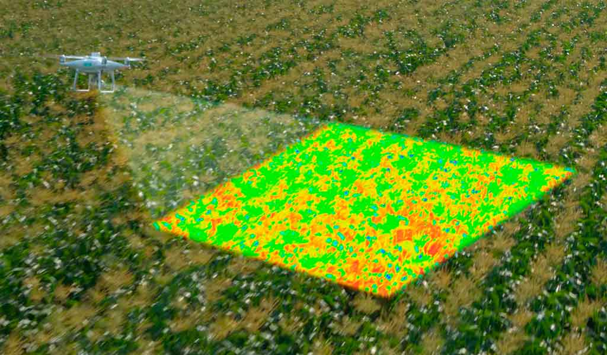

# FOTOGRAMETRIA

La **fotogrametría** es una técnica que permite obtener información precisa de objetos y terrenos a partir de fotografías. Es ampliamente utilizada en topografía, cartografía, arqueología, ingeniería y geología.

##  Inicio

### 1. ¿Qué es?
- Ciencia y técnica para obtener medidas y modelos 3D a partir de imágenes fotográficas.

### 2. Tipos de fotogrametría
- **Aérea**: Fotografías tomadas desde drones, aviones o satélites.
- **Terrestre**: Imágenes captadas desde el suelo con cámaras fijas o móviles.

### 3. Principios básicos
- Uso de la estereoscopía para generar profundidad.
- Triangulación fotogramétrica para calcular coordenadas espaciales.

### 4. Productos principales
- **Ortofotos**: imágenes corregidas geométricamente.
- **Modelos Digitales del Terreno (MDT)**.
- **Nubes de puntos 3D**.
- **Mapas topográficos**.

### 5. Aplicaciones
- Cartografía precisa.
- Monitoreo ambiental.
- Obras civiles.
- Arqueología y documentación patrimonial.

### 6. Ventajas
- Alta precisión.
- Cobertura rápida de grandes áreas.
- Menores costos que métodos tradicionales.

### 7. Herramientas comunes
- Drones con cámaras RGB o multispectrales.
- Software: Pix4D, Agisoft Metashape, DroneDeploy.

##  Panel Fotográfico

---

**Autor:** Limaymanta F. Jimmi A.  
**Correo:** dunkelvolkshoes@gmail.com
**Fecha de creación:**  Junio de 2025

